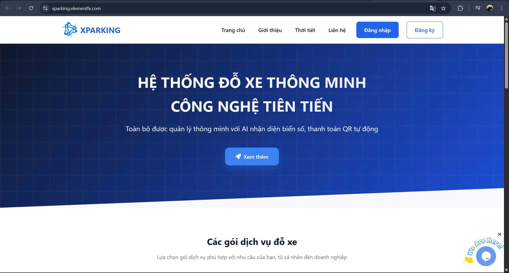
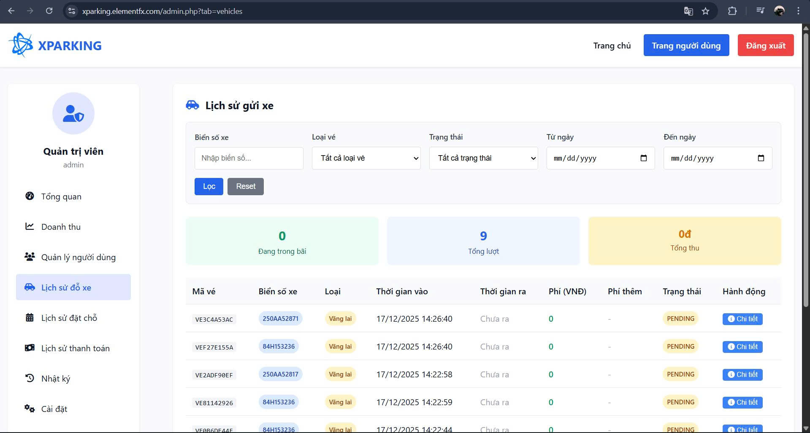
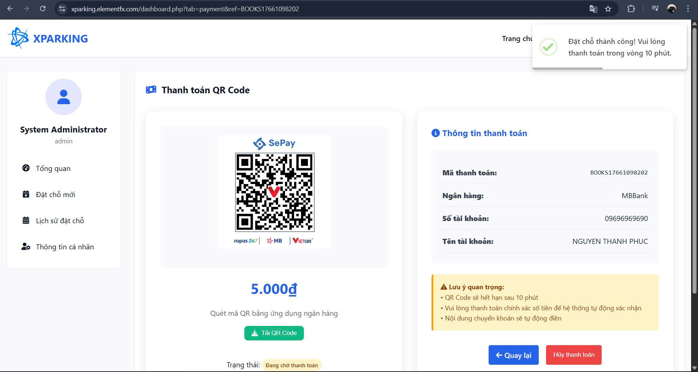

# Xparking_Auto

Hệ thống quản lý và kiểm soát bãi đỗ xe tự động sử dụng công nghệ nhận diện biển số xe, camera IoT và API backend. Dự án này cung cấp giải pháp toàn diện cho bãi đỗ xe hiện đại.

## 🎯 Tính Năng Chính

- **Nhận Diện Biển Số Xe**: Sử dụng YOLOv5 để phát hiện và nhận diện biển số xe
- **Quản Lý Vé**: Hệ thống tạo, quản lý và thanh toán vé tự động
- **Kiểm Soát Cổng**: Điều khiển cổng vào/ra thông qua ESP32 và MQTT
- **Giám Sát Camera**: Kết nối với camera IP ESP32-CAM tại các cổng
- **Quản Lý Chỗ Đỗ**: Theo dõi số chỗ trống và gợi ý chỗ đỗ
- **Thanh Toán Online**: Tích hợp Sepay để thanh toán online
- **Dashboard Quản Lý**: Giao diện web quản lý doanh thu, thống kê bãi đỗ xe

## ⚡ Ưu Điểm Xử Lý Đa Luồng (Multi-Threading)

### Hỗ Trợ 4 Cổng Đồng Thời

- **Xử Lý Độc Lập**: Mỗi cổng vào/ra chạy trên luồng riêng, hoàn toàn độc lập
- **Không Chặn (Non-Blocking)**: Không phải chờ cổng này xong mới xử lý cổng khác
- **Xử Lý Song Song**: Có thể mở/đóng 4 cổng cùng lúc mà không ảnh hưởng nhau
- **Giảm Thời Gian Chờ**: Tối ưu hóa thời gian xử lý, khách hàng không chờ lâu
- **Hiệu Suất Cao**: Có thể xử lý hàng trăm giao dịch vào/ra mỗi giờ

### Kiến Trúc Luồng

```
Main Thread (Master)
    ├── Gate 1 Thread (Cổng Vào 1)
    ├── Gate 2 Thread (Cổng Ra 1)
    ├── Gate 3 Thread (Cổng Vào 2)
    └── Gate 4 Thread (Cổng Ra 2)
         ↓
    Mỗi luồng xử lý độc lập:
    - Nhận diện biển số
    - Kiểm tra vé
    - Điều khiển cổng
    - Ghi log sự kiện
    - Gửi thông báo
```

### Lợi Ích Thực Tế

| Tiêu Chí                    | Không Multi-Threading | Có Multi-Threading |
| --------------------------- | --------------------- | ------------------ |
| Thời gian xử lý 4 giao dịch | ~8-10 giây            | ~2-3 giây          |
| Khả năng xử lý peak         | 10-15 xe/giờ          | 40-60 xe/giờ       |
| Độ trễ                      | Cao (queue)           | Thấp (đồng thời)   |
| Trải nghiệm khách           | Chờ lâu               | Mở cổng nhanh      |

## 💻 Code Thực Hiện Multi-Threading

### 1. **Config & Threading Setup** - `config.py`

```python
import threading

# Threading Locks cho 4 cổng
self.frame_lock_in_gate1 = threading.Lock()    # Cổng vào 1
self.frame_lock_in_gate2 = threading.Lock()    # Cổng vào 2
self.frame_lock_out_gate1 = threading.Lock()   # Cổng ra 1
self.frame_lock_out_gate2 = threading.Lock()   # Cổng ra 2

# Thread objects
self.camera_thread_gate1 = threading.Thread(target=read_exit_webcam_gate1, daemon=True)
self.camera_thread_gate2 = threading.Thread(target=read_exit_webcam_gate2, daemon=True)
self.camera_thread_gate1.start()
self.camera_thread_gate2.start()
```

### 2. **MQTT Multi-Gate Handler** - `mqtt_gate1.py` & `mqtt_gate2.py`

```python
class MQTTGate1:
    def __init__(self, config, system):
        self.mqtt = mqtt.Client()
        self.mqtt.on_connect = self._on_connect
        self.mqtt.on_message = self._on_message  # Xử lý async
        self.mqtt.loop_start()  # Background thread

    def _on_message(self, client, userdata, msg):
        # Mỗi message từ cổng được xử lý trên thread riêng
        topic = msg.topic
        if topic == 'xparking/gate1/entrance':
            # Process Gate 1 Entry - không block các cổng khác
            ...
        elif topic == 'xparking/gate1/exit':
            # Process Gate 1 Exit - độc lập
            ...
```

### 3. **Main System Threading** - `main.py`

```python
class XParkingSystem:
    def __init__(self):
        self._shutdown_event = threading.Event()
        self._ai_loaded = threading.Event()

    def run(self):
        # MQTT - chạy trên background thread
        mqtt_ok = self.functions.init_mqtt()

        # Webcams for EXIT (Gate 1 & Gate 2) - 2 thread riêng
        self.camera.init_cameras()

        # AI Model loading - background thread
        threading.Thread(target=self._load_ai, daemon=True).start()

        # Stream UI - daemon thread
        self._stream_thread = threading.Thread(
            target=self._stream_webcams,
            daemon=True
        )
        self._stream_thread.start()
```

### 4. **Database API Concurrent Access** - `db_api.py`

Sử dụng connection pooling & threading-safe queries:

```python
class DatabaseAPI:
    def __init__(self, config):
        self.db = mysql.connector.connect(
            user=config['db_user'],
            password=config['db_pass'],
            database=config['db_name']
        )  # Mỗi thread có cursor riêng - thread-safe
```

### 5. **HTTP Server API** - `http_server.py`

```python
from flask import Flask
from threading import Thread

app = Flask(__name__)

# API endpoints chạy trên Flask (WSGI)
# Mỗi request được xử lý trên thread pool của gunicorn/werkzeug
@app.route('/api/check-plate', methods=['POST'])
def check_plate():
    # Xử lý song song từ nhiều clients
    ...
```

### 📊 Flow Xử Lý Song Song

```
┌─────────────────────────────────────────────┐
│   HTTP Server (Flask) - Port 5000           │
│   Xử lý: API calls từ frontend              │
└──────────────┬──────────────────────────────┘
               │
┌──────────────┴──────────────────────────────┐
│   Main Thread (XParkingSystem)              │
├──────────────────────────────────────────────┤
│                                              │
│  ┌─────────────────────────────────────┐   │
│  │ MQTT Broker (Background Loop)       │   │
│  │ - Thread 1: Gate 1 In/Out Messages  │   │
│  │ - Thread 2: Gate 2 In/Out Messages  │   │
│  │ - Thread 3: Slots Updates           │   │
│  │ - Thread 4: Alerts                  │   │
│  └─────────────────────────────────────┘   │
│                                              │
│  ┌─────────────────────────────────────┐   │
│  │ Camera Threads (Webcam)             │   │
│  │ - Thread 1: Gate 1 Exit Camera      │   │
│  │ - Thread 2: Gate 2 Exit Camera      │   │
│  │ - Thread 3: Frame Processing        │   │
│  └─────────────────────────────────────┘   │
│                                              │
│  ┌─────────────────────────────────────┐   │
│  │ Background Tasks                    │   │
│  │ - AI Model Loading                  │   │
│  │ - Email Sending                     │   │
│  │ - Database Cleanup                  │   │
│  └─────────────────────────────────────┘   │
│                                              │
└──────────────────────────────────────────────┘
```

## 📸 Demo Giao Diện

### Trang Chủ



### Quản Lý Chỗ Đỗ



### Hệ Thống Đặt Chỗ



### Vé Tự Động


## 🏗️ Kiến Trúc Hệ Thống

```
Frontend (Web)
    ↓
Backend API (Python/PHP)
    ↓
Database (MySQL)
    ↓
Hardware (ESP32, Camera, Gate)
```

## 🔧 Công Nghệ Sử Dụng

### Backend

- **Python**: Flask, OpenCV, YOLOv5
- **PHP**: Custom API
- **Database**: MySQL
- **MQTT**: Quản lý IoT devices
- **Email**: Gửi vé qua email

### Hardware

- **ESP32**: Điều khiển cổng, đọc cảm biến
- **ESP32-CAM**: Chụp ảnh biển số xe

### Frontend

- **HTML/CSS/JavaScript**: Giao diện web
- **PHP**: Server-side rendering

## 📋 Các Module Chính

### 1. **Nhận Diện Biển Số**

- `qr_scanner.py`: Quét mã QR
- `QUET_BSX.py`: Nhận diện biển số xe
- Sử dụng model YOLOv5 đã train sẵn

### 2. **Quản Lý Vé**

- `ticket_system.py`: Tạo và quản lý vé
- `create_ticket.py`: Tạo vé mới
- `db_api.py`: API tương tác với database

### 3. **Kiểm Soát Cổng**

- `mqtt_gate1.py`: MQTT cho cổng 1
- `mqtt_gate2.py`: MQTT cho cổng 2
- `esp32_gate1/esp32_gate1.ino`: Code cho cổng 1
- `esp32_gate2/esp32_gate2.ino`: Code cho cổng 2

### 4. **Camera & Upload**

- `image_uploader.py`: Upload ảnh lên server
- `esp32_cam_gate1/esp32_cam_gate1.ino`: Camera tại cổng 1
- `esp32_cam_gate2/esp32_cam_gate2.ino`: Camera tại cổng 2

### 5. **Web Hosting**

- `hosting-web/`: Toàn bộ code PHP cho website
  - Dashboard quản lý
  - API xử lý thanh toán
  - Quản lý người dùng
  - Thống kê doanh thu

### 6. **Email & Thông Báo**

- `email_handler.py`: Gửi email vé
- `test_mail.py`: Test gửi email

## 🚀 Cài Đặt & Chạy

### Yêu Cầu

- Python 3.8+
- MySQL
- MQTT Broker (Mosquitto)
- Arduino IDE (để upload code ESP32)

### Bước 1: Clone Repository

```bash
git clone https://github.com/Phuc710/Xparking_Auto.git
cd Xparking_Auto
```

### Bước 2: Cài Đặt Dependencies Python

```bash
pip install -r requirements.txt
```

### Bước 3: Cấu Hình

Chỉnh sửa `config.py` với thông tin:

- Database credentials
- MQTT broker settings
- Email config
- API endpoints

### Bước 4: Khởi Tạo Database

```bash
mysql -u root -p < sql/xparking_mysql.sql
```

### Bước 5: Chạy Main Program

```bash
python main.py
```

### Bước 6: Upload Code ESP32

1. Mở Arduino IDE
2. Chọn board: ESP32
3. Mở file từ `arduino/` folder
4. Upload code

## 📁 Cấu Trúc Thư Mục

```
Xparking_Auto/
├── main.py                    # File chính
├── config.py                  # Cấu hình
├── requirements.txt           # Python dependencies
├── sql/
│   └── xparking_mysql.sql    # Database schema
├── arduino/                   # Code cho ESP32
│   ├── esp32_gate1/
│   ├── esp32_gate2/
│   ├── esp32_cam_gate1/
│   └── esp32_cam_gate2/
├── hosting-web/              # Website quản lý
│   ├── api/                   # API endpoints
│   ├── includes/              # Helper functions
│   └── pages/                 # Web pages
├── yolov5/                    # YOLOv5 model
├── model/                     # Trained models
│   ├── LP_detector.pt
│   └── LP_ocr.pt
├── img/                       # Demo images
├── tickets/                   # Lưu vé sinh ra
├── logs/                      # Logs files
└── function/                  # Helper functions
```

## 🔌 MQTT Topics

### Điều Khiển Cổng

```
Topic: xparking/gate1/control
Payload: {"action": "open"}

Topic: xparking/gate2/control
Payload: {"action": "open"}
```

### Camera Stream

```
Topic: xparking/cam1/image
Topic: xparking/cam2/image
```

## 💳 Thanh Toán

Tích hợp **Sepay** để thanh toán online:

- `api/webhook_sepay.php`: Xử lý callback từ Sepay
- Tự động cập nhật trạng thái vé sau khi thanh toán

## 📊 Dashboard Quản Lý

Tính năng chính:

- 📈 Doanh thu theo ngày/tháng/năm
- 📊 Thống kê lượt vào/ra
- 🎯 Xếp hạng doanh thu
- 💰 Chi tiết thanh toán
- 🅿️ Quản lý chỗ đỗ

## 🧪 Test & Debug

```bash
python test_camera.py       # Test camera
python test_mail.py         # Test gửi email
python test_concurrent_api.py  # Test load API
python test_slot_api.py     # Test API slots
```

## 🐛 Troubleshooting

- **Không kết nối được MQTT**: Kiểm tra MQTT broker đang chạy
- **Lỗi Database**: Đảm bảo MySQL service đang chạy
- **Camera không hoạt động**: Kiểm tra kết nối mạng ESP32-CAM
- **Email không gửi**: Cấu hình lại SMTP trong `config.py`

## 📝 Ghi Chú Quan Trọng

- Đảm bảo MQTT broker đang chạy trước khi start `main.py`
- Cấu hình firewall cho phép kết nối database
- Camera ESP32 cần kết nối mạng ổn định
- Kiểm tra thường xuyên logs files trong thư mục `logs/`

## 👨‍💻 Tác Giả

**Phuc710** - Phát triển toàn bộ hệ thống Xparking_Auto

## 📄 License

MIT License

## 🔗 Liên Hệ

- GitHub: https://github.com/Phuc710/Xparking_Auto

---

**Cập nhật lần cuối**: December 2025
Được phát triển với ❤️ cho hệ thống quản lý bãi đỗ xe tự động
